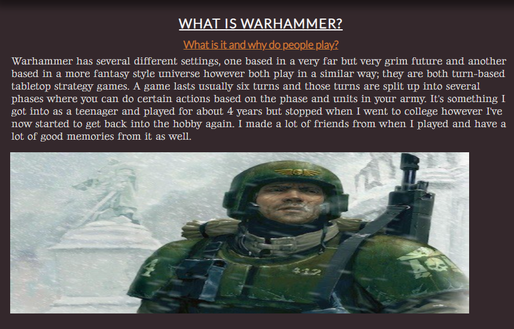

# An Introduction to Warhammer 
 
This is a website that is supposed to be an insight to the game, universe and hobby that is Warhammer. I want it to be both informative for people who haven't played the game or for people who don't know much about it and I also want it that to be from a personal point of view as it's something I grew up playing and made a lot of good friends whilst 
I played as a teenager. The website is split into four sections; What is warhammer which is a brief overview of the hobby and game, Warhammer 40,000 which focuses on the lore
and factions within that and Age of Sigmar which focuses on the lore and factions within that universe as well. Finally there is the Warhammer games section which are video games that are based in universe to show Warhammer represented in a different form of media. 

## Features 

### Existing Features

- __Navigation Bar__

  The navigation bar is there to help the reader navigate the page and it is set up so that the transitions are smooth once clicked. It's also in a fixed position on the page so that it will always be visible to the user to help with navigation. 

- __The landing page image__

  This image is here to state what Warhammer is, a tabletop strategy game, but is mostly meant to draw the reader in. To help with this, I added a zoom animation to the image that plays when the page loads to catch the readers eye. 

- __What is Warhammer Section__

 The What is Warhammer section is there to give brief overview of the hobby, what the setting is and how it's actually played. This section is a mixture of personal insight and information as I wanted to include the thoughts I had when getting into the hobby, both as a teenager and now as an adult. 

- __Warhammer:40,000 section__

  This section is here to go into details on the universe of Warhammer 40,000; To describe what it's like, what humanity is like in this setting and the other alien and demonic races within it as well. This is meant to inform the user in greater detail compared to the brief overview from the What is Warhammer section that precedes it. 

- __Warhammer: Age of Sigmar section__

This section is here to inform the user of the fantasy setting that is Warhammer: Age of Sigmar and the races that inhabit it as well. This again is designed to be more informative and detailed than the What is Warhammer section.

- __Warhammer Games section__

This section is here to go into details on the universe of Warhammer 40,000; To describe what it's like, what humanity is like in this setting and the other alien and demonic races within it as well. This is meant to inform the user in greater detail compared to the brief overview from the What is Warhammer section that precedes it. 

- __The Footer__ 

  This has a link to my linkedin and github repository and also to say that the website is made by me. 

- __The Subscribe Page__

  - The subscribe page is to allow users to subscribe for more content and information regarding Warhammer. 

### Features Left to Implement

- 

## Testing 

The goal of this project is to provide a website to inform the user in a simple, digestible format about Warhammer and the different aspects to it. The main features of the website are the navigation bar, the hero image, the text and images and the submission form. 

There was a lot of testing and issues when it came to trying to solve the media query however I didn't run into as many interesting issues when coding the main features of the page, mostly formatting issues. The navigation bar allows the user to easily navigate the page and I've set it up so that when a link is clicked the transition between pages is done smoothly rather than suddenly jumping down to it. The hero image is there to catch the users attention and is set up so that it is animated to zoom in when the page loads up. The text and images is set up in a design using display:flex; each one is it's own div that is styled using display:flex to format it. I also have all the images the same size to keep them uniform as the images naturally are all different sizes. Finally, the submission form is there to allow the user to sign up with their email address to potentially receive more information about Warhammer. This doesn't actually do anything, I don't plan on making a warhammer newsletter for people who sign up, but I wanted this here to try to show off different skills in html and css, to show that I can make and style a form. 

As mention above, a big sticking point for this project was trying to make it responsive for mobile devices. This was due to several reasons; my method of layout and the long names listed in the header. These two parts of the website would break on smaller screens, the menu would end up on top of itself and the text would stretch whilst the image remain static. 

Example of header 
Example of text stretching 

I began to resolve this issue by adding a media query for making the layout swap to lose the display flex at 600px. This made it so that the text would appear on top of it's respective image, I also made the width of the images a responsive size as well rather than a static pixel size. I also needed to shrink down the size of the h3 headings at smaller sizes as some of them would spill out the sizing for the page on mobile as well.

Example of fixing the text at 600px and below 

The other major issue was the the navigation bar at the top of the page. The header would break and end up on top itself as shown above. Before adding the media query, I shortened "Warhammer" down to "WH" to try and avoid this problem as well as shortening "Age of Sigmar" to "AoS". This would still break however so I had followed the video guide for the Love Running website in order to try and fix the issue. This made it so that when viewed on a screen that was 600px or less, the menu would float to the left and sit nicely under the main title, rather than to the right of it. I also shrunk the text down and gave it a smaller margin. Furthermore, I made the font size for the main title smaller as well as well as reducing the letter spacing overall as well. 

Example of fixing the menu at 600px and below 

Finally, I needed to fix the hero image as well; the cover text box was not showing properly on the page for mobile as it would only show the right half of it. So this needed to be made so that it sits flush with the left hand side of the page and I made the width 100% responsive as well so it would cover the width of the screen rather than being a static 400px. 

Example of the cover text at 600px and below 

So these changes made the website more responsive for mobile however the text and images were still breaking between 800-1200px. The text would still stretch and the menu would break as well due to the length of the title to the page. I increased the media queary rule to 800px but I couldn't take it any higher with the rules that I have in place. It would either break as mentioned or the query would be implemented too early and the menu would be left with a lot of unused space and over stretched images. 

Example of media query on the menu implemented at 1000px 

Example of media query on the text and images implemented at 1000px 

So the best way I found to resolve this was to implement another media query at 1200px that was originally going to focus on the same elements as the previous media query, the text, images, hero image and header. However at this size the hero image isn't broken so I removed that part of the rule. I also shortened the title of the page as well, going from "An introduction to Warhammer" to just "Warhammer". This made it much easier to fix the media query at both sizes but also meant I didn't need to implement a rule here either as it worked all the way down to 800px where the first rule applies itself. So after that the only thing I needed to implement with this rule was the changes to text and images, making them it all a block display form and making the image widths responsive. The 100% width rule here was too much, it stretched the images too much so instead made the images take up 70% of the screen, I also centred them at this rule as there was a little too much dead space to the right of the image for my liking. 

Example of the 1200px media query on the menu 

Example of the 1200px media query on the hero image 

Example of the 1200px media query on the text and images 

The website has also been tested to see if it works on multiple browsers. I have tested the webiste on Firefox, Chrome and Edge and the website works on all of these websites as intended, the media queries also apply as they should as well. The only difference between them is that the font for the H1 and H2s, Lato, on Firefox is slightly different to the intended look of the font that works on Edge and Chrome. I don't believe that this is an issue in the code, the font is showing as a recognised font on the developer tools on Firefox as well. I do believe that I have implemented my rules for importing the font correctly as well, hence why it works on Edge. I can't say why this is happening however I don't believe this is necessarily a bug. Other than that, the websites are working as intended on all three browsers. 

The website working on Chrome 

The website working on Firefox 

The website working on Edge 

### Validator Testing 

- HTML
  - No errors were returned when passing through the official [W3C validator](https://validator.w3.org/nu/?doc=https%3A%2F%2Fchcheshire.github.io%2FProject-1-Warhammer%2F)
- CSS
  - No errors were found when passing through the official [(Jigsaw) validator](https://jigsaw.w3.org/css-validator/validator?uri=https%3A%2F%2Fchcheshire.github.io%2FProject-1-Warhammer%2F)

### Unfixed Bugs

There are no bugs that have been left unfixed in my code, it's all working as it should be. The only thing I can point out that isn't necessarily a bug but soemthing that it's a little odd is the issue with the Lato font on Firefox. 

As stated previously, I can't say as to why the font looks different on Firefox than what it does on Chrome and Edge. I don't believe this is a bug in my code as it is appearing in the developer tools for Firefox as a recognised font and I believe it is implemented properly in my code as well, hence why it works elsewhere. If I wanted it to look consistent between the three sites, I could change the font that I chose for the H1 and H2s. However there is nothing to say that this might not come up again so it may just be a case of trial and error to find one that is consistent for all three. I don't see this as a bug though, just something that's odd with Firefox and I don't believe it detracts from the website either. For those reasons I'm leaving the font choice as it is.

## Deployment

The site was deployed to GitHub pages. The steps to deploy are as follows: 
  - In the [GitHub repository](https://github.com/CHCheshire/Project-1-Warhammer), navigate to the Settings tab 
  - From the source section drop-down menu, select the **Main** Branch, then click "Save".
  - The page will be automatically refreshed with a detailed ribbon display to indicate the successful deployment.

The live link can be found [here](https://chcheshire.github.io/Project-1-Warhammer/)

### Local Deployment

In order to make a local copy of this project, you can clone it. In your IDE Terminal, type the following command to clone my repository:

- `git clone https://github.com/CHCheshire/Project-1-Warhammer.git`

Alternatively, if using Gitpod, you can click below to create your own workspace using this repository.

## Credits 

In this section you need to reference where you got your content, media and extra help from. It is common practice to use code from other repositories and tutorials, however, it is important to be very specific about these sources to avoid plagiarism. 

You can break the credits section up into Content and Media, depending on what you have included in your project. 

### Content 

  The text I used was written by myself. The lore, Warhammer, Warhammer:40,000 and Warhammer: Age of Sigmar are properties of Games Workshop [Games Workshop](https://www.games-workshop.com/en-GB/Home) 

  Total War: Warhammer is a product made by Creative Assembly [Creative Assembly](https://www.creative-assembly.com/)

  The Dawn of War series and Warhammer 40,000: Space Marine are both products made by Relic games [Relic](https://www.relic.com/)

  The instructions on how to implement the header were from the Love Running 04: Header structure video [Media Upload](https://www.youtube.com/watch?v=t1vkQ3zJCJs) 

  The instructions for implementing the hero image were taken from this video [Media Upload](https://www.youtube.com/watch?v=85Ke-cdu6QQ)

  The Hero image animation for it zooming in were taken from this video [Media Upload](https://www.youtube.com/watch?v=85Ke-cdu6QQ)

  The design for the text aligning with the images were taken from this tutorial on W3Schools [W3Schools](https://www.w3schools.com/css/css_align.asp) 

  The styling for the subscribe form came from this tutorial on W3Schools [W3Schools](https://www.w3schools.com/howto/howto_css_signup_form.asp)

### Media

  The aliens-image.jpg image was from the Warhammer 40k Wiki 

  The chaos-image.jpg image was from Tumblr 

  The dawn-of-war-image.png image was from Gamers Decide 

  The death-image.jpg image was from Pintrest 

  The fyreslayers-image.jpg was from Warhammer Community 

  The hero-image.jpg image was from Mocah wallpapers  

  The imperium-image.jpg image was from Quora  

  The order-image.jpg image was from Lexicanum  

  The orruk-image.jpg image was from TheGamer  

  The play-image.jpg image was from Warhammer40000  

  The settings-image.jpg image was from ageofminiatures  

  The space-marine-image.jpg image was from gamesplanet  

  The total-war-image.jpg image was from ArtStation  

  The what-is-it-image.jpg image was from Bell of Lost Souls 