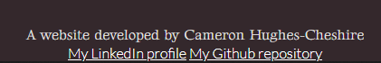

# An Introduction to Warhammer 
 
This is a website that is supposed to be an insight to the game, universe and hobby that is Warhammer. I want it to be both informative for people who haven't played the game or for people who don't know much about it and I also want it that to be from a personal point of view as it's something I grew up playing and made a lot of good friends whilst 
I played as a teenager. The website is split into four sections; What is warhammer which is a brief overview of the hobby and game, Warhammer 40,000 which focuses on the lore
and factions within that and Age of Sigmar which focuses on the lore and factions within that universe as well. Finally there is the Warhammer games section which are video games that are based in universe to show Warhammer represented in a different form of media. 

## Features 

The navigation bar is there to help the reader navigate the page and it is set up so that the transitions are smooth once clicked. It's also in a fixed position on the page so that it will always be visible to the user to help with navigation.

### Existing Features

- __Navigation Bar__

  The navigation bar is there to help the reader navigate the page and it is set up so that the transitions are smooth once clicked. It's also in a fixed position on the page so that it will always be visible to the user to help with navigation. 

- __The landing page image__

  This image is here to state what Warhammer is, a tabletop strategy game, but is mostly meant to draw the reader in. To help with this, I added a zoom animation to the image that plays when the page loads to catch the readers eye. 

- __What is Warhammer Section__

 The What is Warhammer section is there to give brief overview of the hobby, what the setting is and how it's actually played. This section is a mixture of personal insight and information as I wanted to include the thoughts I had when getting into the hobby, both as a teenager and now as an adult. 

- __Warhammer:40,000 section__

  This section is here to go into details on the universe of Warhammer 40,000; To describe what it's like, what humanity is like in this setting and the other alien and demonic races within it as well. This is meant to inform the user in greater detail compared to the brief overview from the What is Warhammer section that precedes it. 

- __Warhammer: Age of Sigmar section__

This section is here to inform the user of the fantasy setting that is Warhammer: Age of Sigmar and the races that inhabit it as well. This again is designed to be more informative and detailed than the What is Warhammer section.

- __Warhammer Games section__

This section is here to go into details on the universe of Warhammer 40,000; To describe what it's like, what humanity is like in this setting and the other alien and demonic races within it as well. This is meant to inform the user in greater detail compared to the brief overview from the What is Warhammer section that precedes it. 

- __The Footer__ 

  This has a link to my linkedin and github repository and also to say that the website is made by me. 

- __The Subscribe Page__

  - The subscribe page is to allow users to subscribe for more content and information regarding Warhammer. 

### Features Left to Implement

- 

## Testing 

In this section, you need to convince the assessor that you have conducted enough testing to legitimately believe that the site works well. Essentially, in this part you will want to go over all of your project’s features and ensure that they all work as intended, with the project providing an easy and straightforward way for the users to achieve their goals.

In addition, you should mention in this section how your project looks and works on different browsers and screen sizes.

You should also mention in this section any interesting bugs or problems you discovered during your testing, even if you haven't addressed them yet.

If this section grows too long, you may want to split it off into a separate file and link to it from here.

### Validator Testing 

- HTML
  - No errors were returned when passing through the official [W3C validator](https://validator.w3.org/nu/?doc=https%3A%2F%2Fchcheshire.github.io%2FProject-1-Warhammer%2F)
- CSS
  - No errors were found when passing through the official [(Jigsaw) validator](https://jigsaw.w3.org/css-validator/validator?uri=https%3A%2F%2Fchcheshire.github.io%2FProject-1-Warhammer%2F)

### Unfixed Bugs

You will need to mention unfixed bugs and why they were not fixed. This section should include shortcomings of the frameworks or technologies used. Although time can be a big variable to consider, paucity of time and difficulty understanding implementation is not a valid reason to leave bugs unfixed. 

## Deployment

The site was deployed to GitHub pages. The steps to deploy are as follows: 
  - In the [GitHub repository](https://github.com/CHCheshire/Project-1-Warhammer), navigate to the Settings tab 
  - From the source section drop-down menu, select the **Main** Branch, then click "Save".
  - The page will be automatically refreshed with a detailed ribbon display to indicate the successful deployment.

The live link can be found [here](https://chcheshire.github.io/Project-1-Warhammer/)

### Local Deployment

In order to make a local copy of this project, you can clone it. In your IDE Terminal, type the following command to clone my repository:

- `git clone https://github.com/CHCheshire/Project-1-Warhammer.git`

Alternatively, if using Gitpod, you can click below to create your own workspace using this repository.

## Credits 

In this section you need to reference where you got your content, media and extra help from. It is common practice to use code from other repositories and tutorials, however, it is important to be very specific about these sources to avoid plagiarism. 

You can break the credits section up into Content and Media, depending on what you have included in your project. 

### Content 

  The text I used was written by myself. The lore, Warhammer, Warhammer:40,000 and Warhammer: Age of Sigmar are properties of Games Workshop [Games Workshop](https://www.games-workshop.com/en-GB/Home) 

  Total War: Warhammer is a product made by Creative Assembly [Creative Assembly](https://www.creative-assembly.com/)

  The Dawn of War series and Warhammer 40,000: Space Marine are both products made by Relic games [Relic](https://www.relic.com/)

  The instructions on how to implement the header were from the Love Running 04: Header structure video [Media Upload](https://www.youtube.com/watch?v=t1vkQ3zJCJs) 

  The instructions for implementing the hero image were taken from this video [Media Upload](https://www.youtube.com/watch?v=85Ke-cdu6QQ)

  The Hero image animation for it zooming in were taken from this video [Media Upload](https://www.youtube.com/watch?v=85Ke-cdu6QQ)

  The design for the text aligning with the images were taken from this tutorial on W3Schools [W3Schools](https://www.w3schools.com/css/css_align.asp) 

  The styling for the subscribe from came from this tutorial on W3Schools [W3Schools](https://www.w3schools.com/howto/howto_css_signup_form.asp)

### Media

- The photos used on the home and sign up page are from This Open Source site
- The images used for the gallery page were taken from this other open source site

